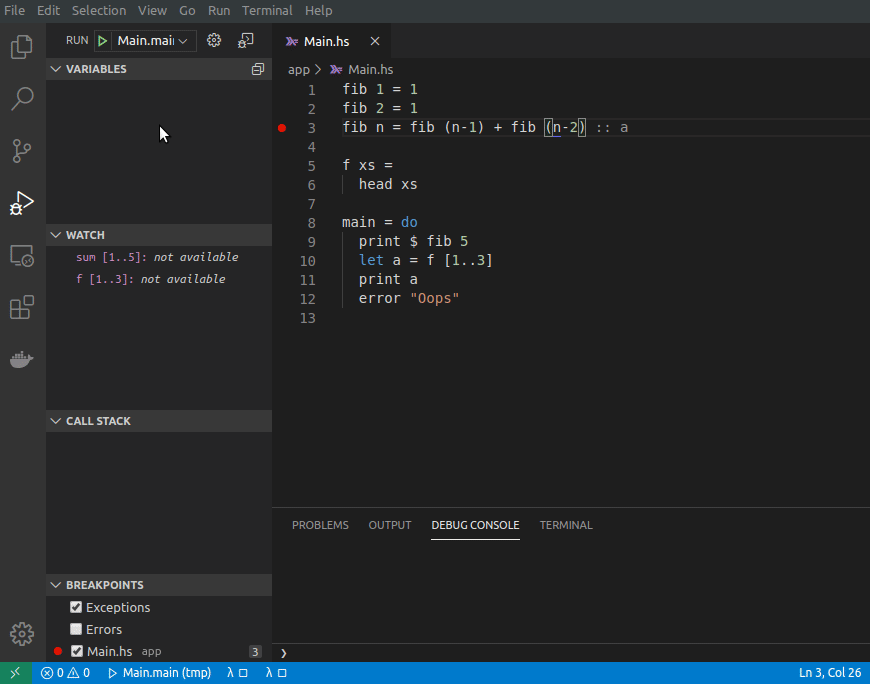

# VSCode GHCi Debugger

Barebone TypeScript adapter to GHCi Debugger.  

## Installation

Does not depends on any additional packages or prob=grams to be installed.  
Just install this extension and it should work with variety of Haskell projects (stack, cabal, cabal new, bare ghci).

## Features

## Current state

First prelimirary version which *mostly works* but is not yet production ready
